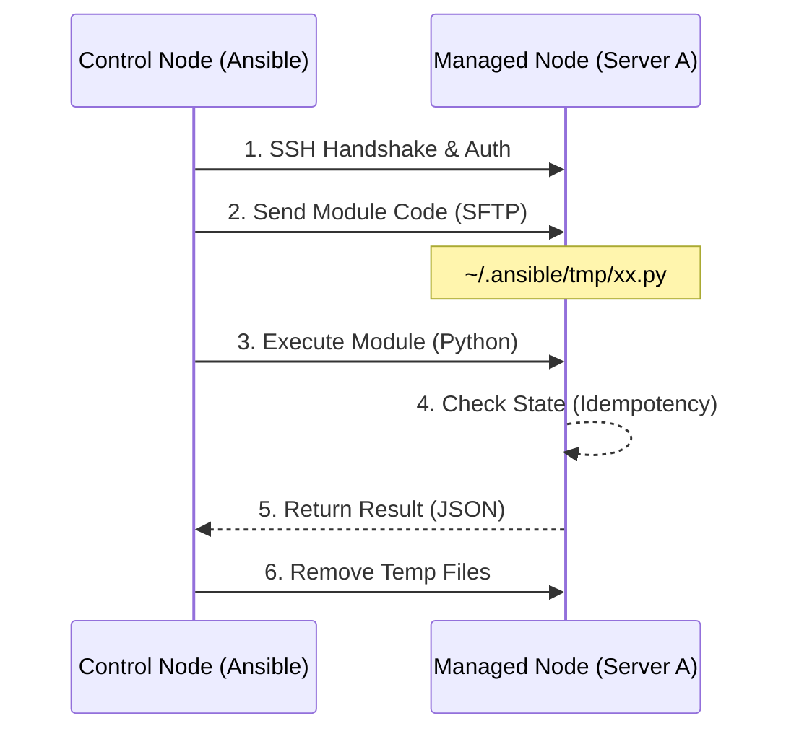

# 01-Concept & Philosophy

> **Goal**: Understand "Why" Ansible is designed this way and how it differs from traditional scripting.

## 1. Agentless Architecture

**Definition**: Ansible does not require installing a daemon (Agent) on Managed Nodes, unlike Puppet or Zabbix.

### Deep Dive: Underlying Principles
*   **Communication Mechanism**: Ansible reuses the existing **OpenSSH** protocol. If your machine can be connected via SSH, it can be managed by Ansible.
*   **Execution Logic**: The Control Node pushes **Module** code (usually Python scripts) to the target node's temporary directory (default `~/.ansible/tmp/`) via SFTP/SCP, executes it, and then deletes it.
*   **Advantages**: Zero resource residency, zero increased attack surface, immediate adoption.

## 2. Idempotency

**Definition**: The result is consistent regardless of how many times it is executed.

### Why it matters
*   **Script Mindset**: `mkdir /tmp/data` -> Second execution fails with "File exists".
*   **Ansible Mindset**: `state: directory` -> First time creates it; second time detects it exists and **Skips** (Status: `OK` instead of `Changed`).

### Underlying Implementation
Every module collects "Facts" (current state) from the target system before executing changes, comparing them with the "Desired State". Actions are triggered only when there is a discrepancy.

## 3. Workflow Visualization

