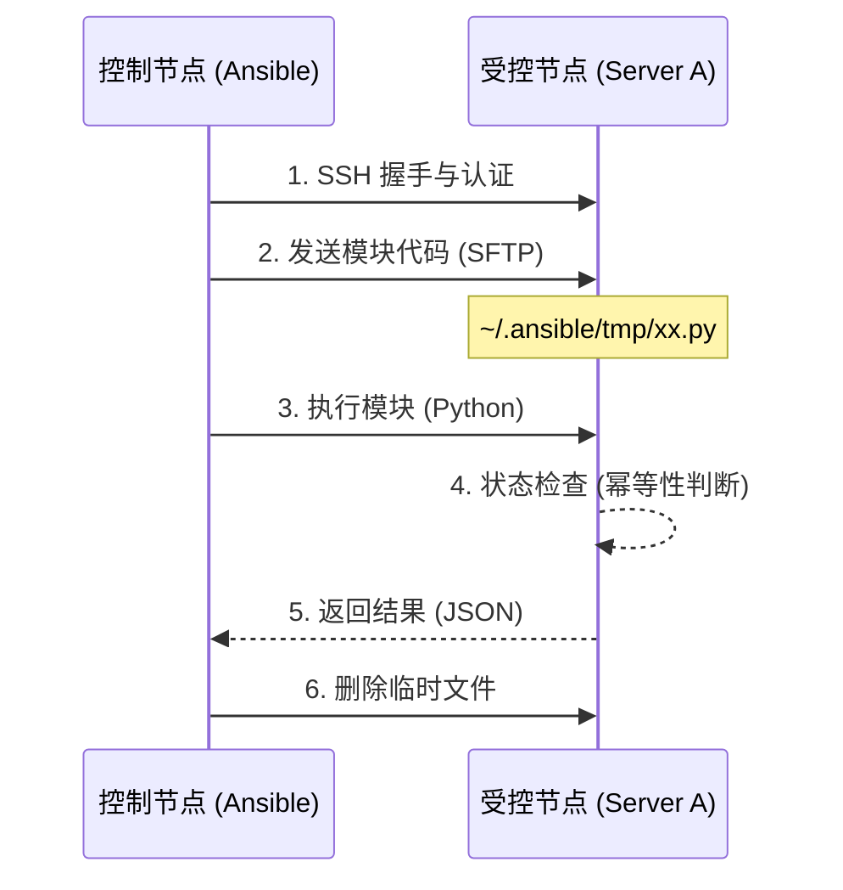

# 01-核心概念与哲学 (Concept & Philosophy)

> **本章目标**: 理解 Ansible "为什么" 这样设计，以及它与传统脚本思维的区别。

## 1. 无代理架构 (Agentless Architecture)

**定义**: Ansible 不需要像 Puppet 或 Zabbix 那样在被管理节点 (Managed Nodes) 上安装守护进程 (Agent)。

### 深度解析：底层原理
*   **通信机制**: Ansible 复用现有的 **OpenSSH** 协议。如果你的机器能通过 SSH 连接，它就能被 Ansible 管理。
*   **执行逻辑**: 控制节点 (Control Node) 将 **模块 (Module)** 代码（通常是 Python 脚本）通过 SFTP/SCP 推送到目标节点的临时目录（默认 `~/.ansible/tmp/`），执行完毕后自动删除。
*   **核心优势**: 零资源驻留，零攻击面增加，立即上手。

## 2. 幂等性 (Idempotency)

**定义**: 无论执行多少次，结果都是一致的。

### 为什么它很重要 (Why it matters)
*   **脚本思维**: `mkdir /tmp/data` -> 第二次执行会报错 "File exists"（文件已存在）。
*   **Ansible 思维**: `state: directory` -> 第一次创建；第二次检测到已存在则 **跳过 (Skipped)**（状态显示为 `OK` 而非 `Changed`）。

### 底层实现
每个模块在执行变更前，会先收集目标系统的 "Facts"（当前状态），并与 "Desired State"（期望状态）进行对比。只有当两者不一致时，才会触发实际的操作 (Action)。

## 3. 工作流可视化 (Workflow Visualization)

