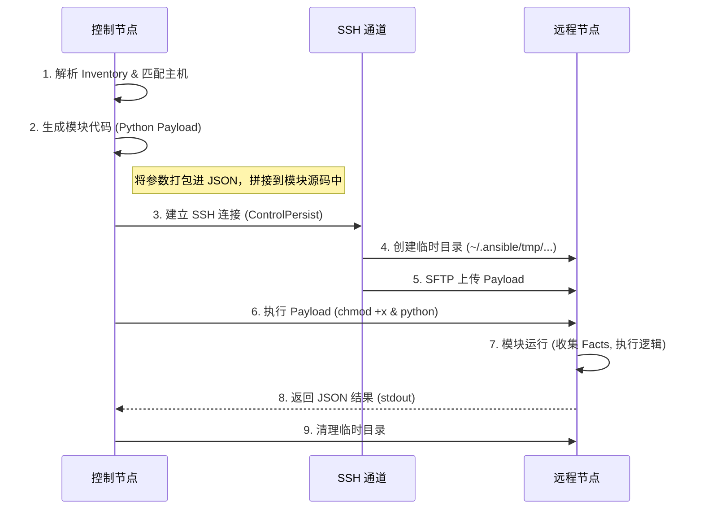

# 03-深度解析 (Deep Dive)

> **本章目标**: 跳出“如何使用”的表层，深入 Ansible 的内核，理解从 Inventory 解析到 Module 执行的完整生命周期。

## 1. 清单与变量优先级 (Inventory & Variable Precedence)

Ansible 如何知道该操作哪些主机？变量发生冲突时听谁的？

### 1.1 静态与动态清单 (Static vs Dynamic Inventory)
*   **静态清单 (Static)**: 简单的 `.ini` 或 `.yaml` 文件，适合固定架构。
*   **动态清单 (Dynamic)**: Python 脚本或插件，实时查询云厂商 API (AWS/Aliyun) 或 CMDB，获取主机列表。

### 1.2 变量优先级金字塔 (The Pyramid of Precedence)
当同一个变量在多处定义时，Ansible 遵循严格的覆盖规则（由低到高，后者覆盖前者）：

1.  **Role defaults** (最低优先级)
2.  **Inventory group_vars**
3.  **Inventory host_vars**
4.  **Playbook group_vars**
5.  **Playbook host_vars**
6.  **Play vars**
7.  **Task vars** (最高优先级，除了命令行传参)
8.  **Extra vars** (`-e` 命令行参数，绝对霸权)

> **最佳实践**: 尽量在 `group_vars` 中定义通用变量，在 `host_vars` 中定义特例，避免滥用 `-e` 导致调试困难。

## 2. 模块执行全链路 (Module Execution Lifecycle)

当你运行 `ansible web -m ping` 时，底层究竟发生了什么？

### 关键技术点解析
*   **Ansiballz**: 现代 Ansible 使用 "Ansiballz" 框架，将模块及其依赖打包成一个 zip 文件，通过 stdin 传给远程 python 解释器，极大提升了传输效率。
*   **Shebang Injection**: Ansible 会自动探测远程 python 路径（如 `/usr/bin/python3`），并替换脚本头部的 Shebang。

## 3. 提权机制 (Privilege Escalation: Become)

为什么在 Playbook 中写 `become: yes` 就能用 root 权限？

*   **原理**: Ansible 不会直接以 root 登录（这是安全大忌）。它先以普通用户登录，然后通过 `sudo` (默认)、`su` 或 `doas` 切换身份。
*   **命令包装**:
    *   原始命令: `service nginx restart`
    *   包装后: `sudo -H -S -n -u root /bin/sh -c '...'`
*   **Troubleshooting**:
    *   报错 `Missing sudo password`: 远程用户 sudo 需要密码，但未在 Ansible 中配置 (`--ask-become-pass`)。

## 4. 执行策略 (Strategy)

默认情况下，Ansible 采用 **Linear (线性)** 策略：所有主机必须完成 Task 1，才能一起进入 Task 2。

*   **Linear (默认)**: 像阅兵一样齐头并进。如果一台机器卡住，所有机器等待。
*   **Free (自由)**: 像赛跑一样，每台主机尽可能快地跑完所有 Task，互不等待。
*   **Serial (滚动)**: `serial: 2` 表示一次只操作 2 台主机，适合生产环境灰度发布 (Canary Deployment)。
